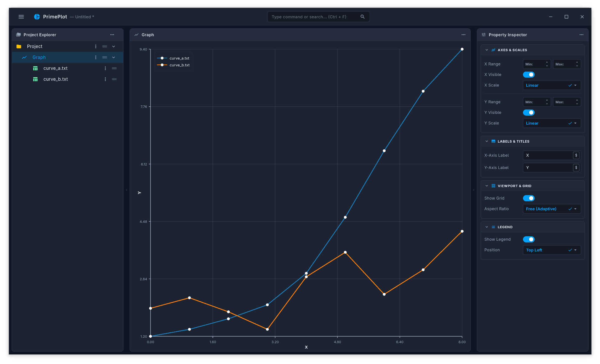
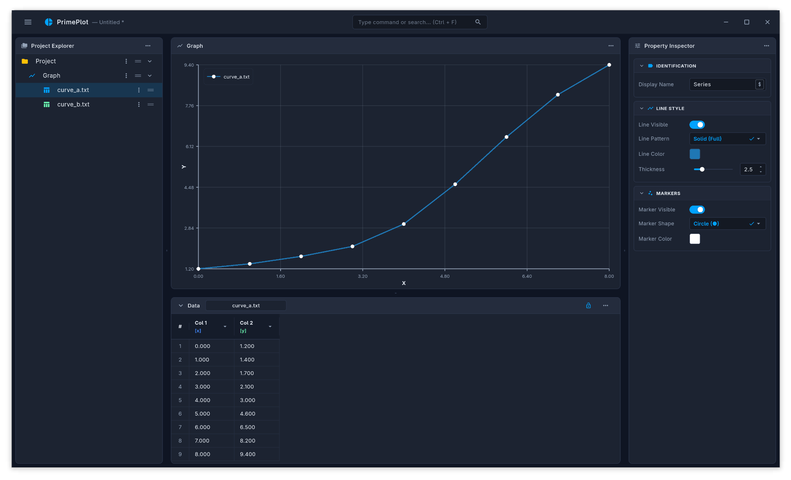

# PrimePlot

PrimePlot is a personal, open-source project that aims to be a high-performance, modern scientific plotting desktop application. The goal is to provide a lightweight and responsive tool for scientists, engineers, and technicians to plot, customize, and export data.

<table>
  <tr>
    <td></td>
    <td></td>
  </tr>
</table>

> [!CAUTION]
> The project is in a very early stage of development. Chart export is not yet supported — at the moment, plotting, axis/color customization, and saving/loading data are available. Do not use in production.

## Features

- [x] Basic data plotting
- [x] Import support for multiple data formats
- [x] Chart customization (colors, axes)
- [x] Save/load data
- [ ] Chart customization (legends, styles)
- [ ] Chart export (PNG, SVG, PDF...)
- [ ] Themes (dark/light)

> Non-exhaustive list — the project is in its early steps, and the feature list is expected to grow (and change) over time.

## Tech Stack

- **[Flutter](https://flutter.dev/)** — cross-platform graphical interface
- **[Rust](https://www.rust-lang.org/)** — processing core and performance

## Installation

> The project is still in an early stage, and for now the only way to run it is by building from source. See [docs/Installation.md](docs/Installation.md) for step-by-step instructions.

## Usage

> Coming soon, alongside the first export/customization features.

## Roadmap

- [ ] Chart customization (legends, styles)
- [ ] Chart export
- [ ] Themes (dark/light)
- [ ] Packaging for Windows/Linux/macOS

## Contributing

This is a personal project, maintained without much commitment to fixed deadlines or schedules. There is currently no formal contribution process defined.

> [!NOTE]
> I plan to add a **CLA (Contributor License Agreement)** before opening the project to external contributions, in order to avoid future issues related to code ownership rights. Until then, external contributions are not enabled.

## License

This project is licensed under the **GNU General Public License v3.0 (GPLv3)**. See the [LICENSE](LICENSE) file for more details.

## Author

Developed by Filipe Estevão.
